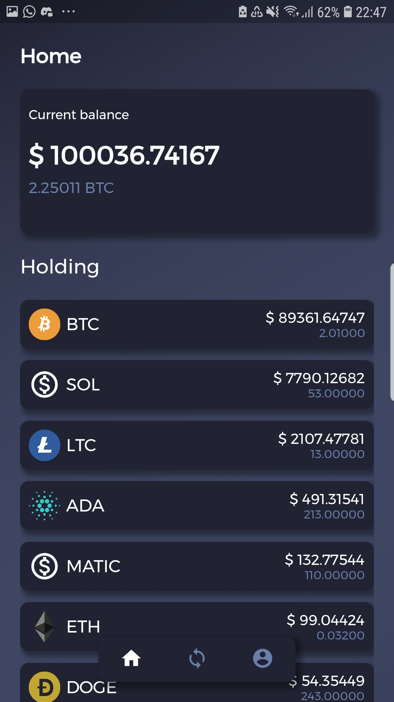
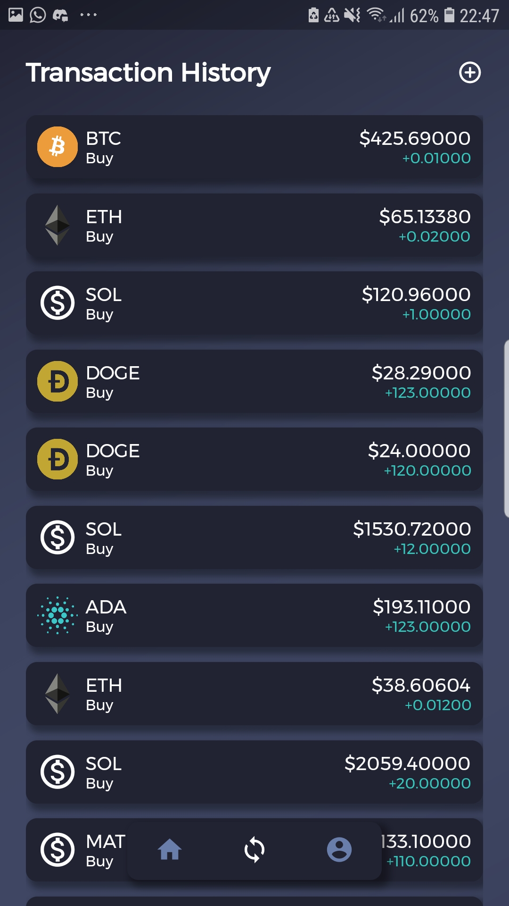
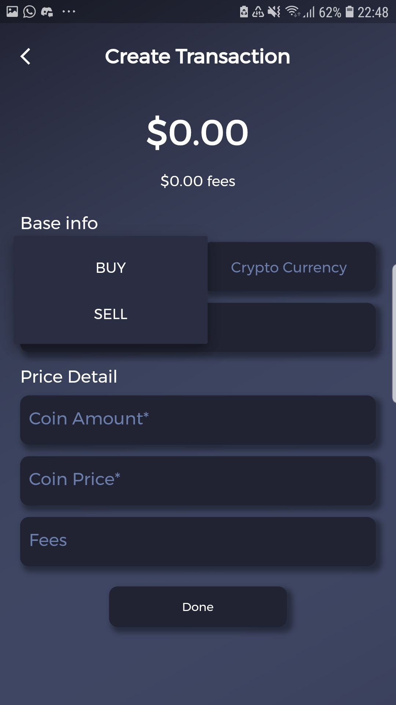
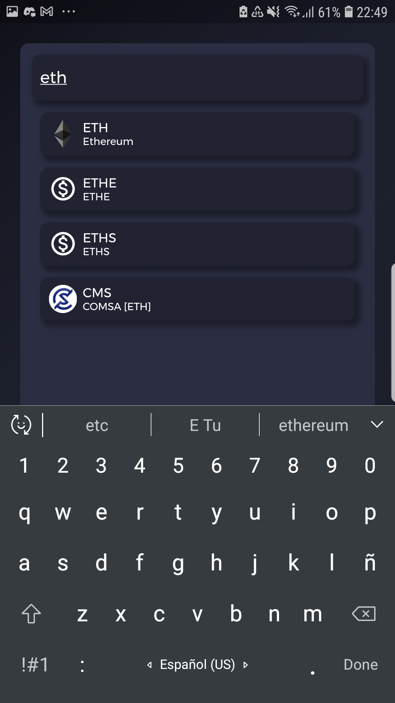
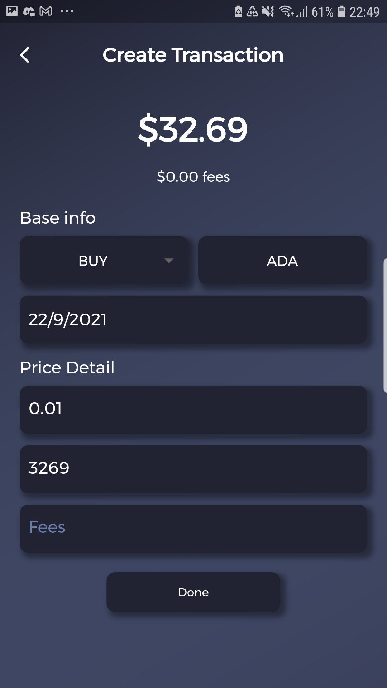
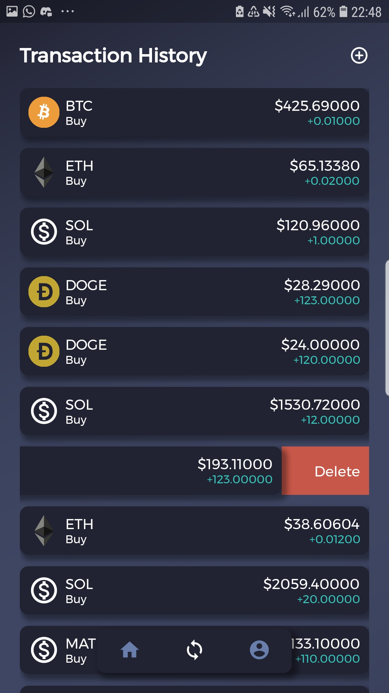
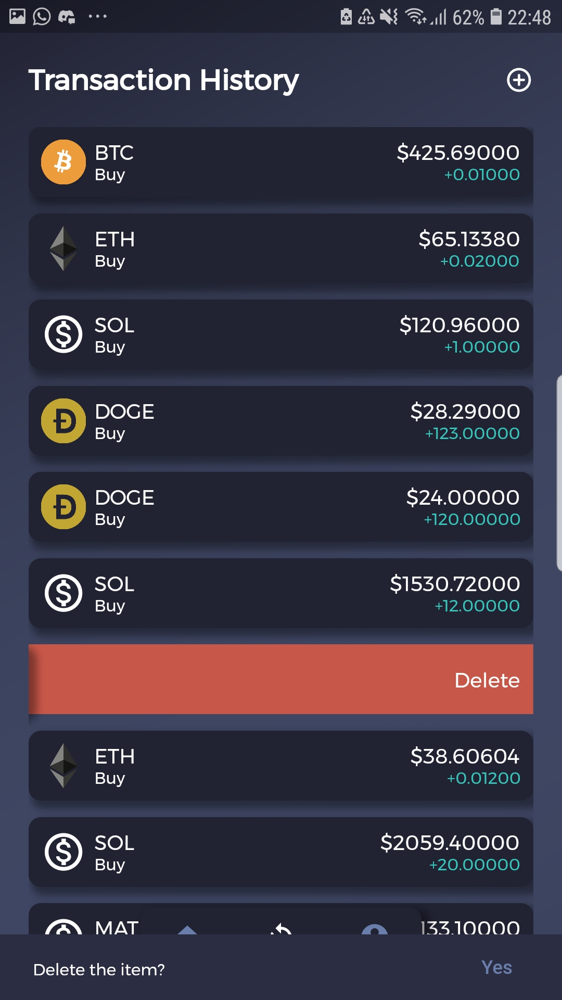
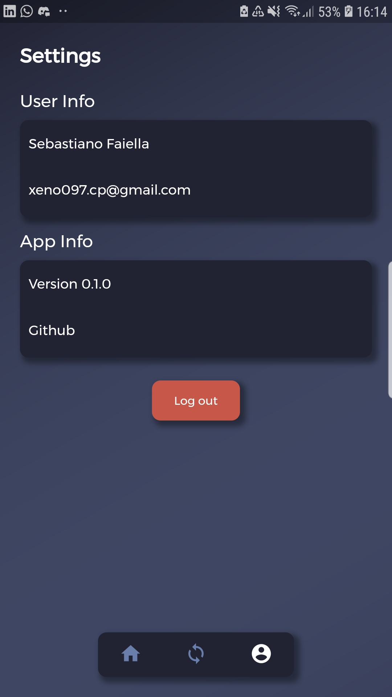

# Crypto Journal Mobile

  

Crypto Journal is the app for crypto investors that want to keep track of their operations in a simple and accessible way.

## Tech Stack

Crypto journal is powered by [Flutter](https://flutter.dev/), uses [Riverpod](https://riverpod.dev/) as state manager and relies on [Firebase](https://firebase.google.com/) to handle user sign in. Backend communication is handled by [Graphql](https://graphql.org/).

## Architecture

This project implements a variation of the clean architecture proposed by Uncle Bob (Robert C. Martin), explained [here](https://blog.cleancoder.com/uncle-bob/2012/08/13/the-clean-architecture.html) and by the excellent course made by [Reso Coder](https://github.com/ResoCoder) and avaliable on [youtube](https://www.youtube.com/playlist?list=PLB6lc7nQ1n4iYGE_khpXRdJkJEp9WOech)

## Features

### Login

The app allows its users to sign-in/sign-up with either `Facebook` or `Google`.

### Overview

The home screen shows a general overview of the coins held by a user and its current value in [fiat money](https://en.wikipedia.org/wiki/Fiat_money)

<!--  -->

### Transaction History

Allows a user to track his operations sorted by date. This screen has pagination support.

### Create a Transaction

A user can create transactions to keep track of his operations and keep his holding information updated.

### Transaction Delete

A user can delete a transaction by swiping on one of the tabs and needs to confirm if he really wants to delete the item.

### User Data

A simple screen that shows which user is currently logged in and allows to sign-out.

## License

[MIT](./LICENSE)
